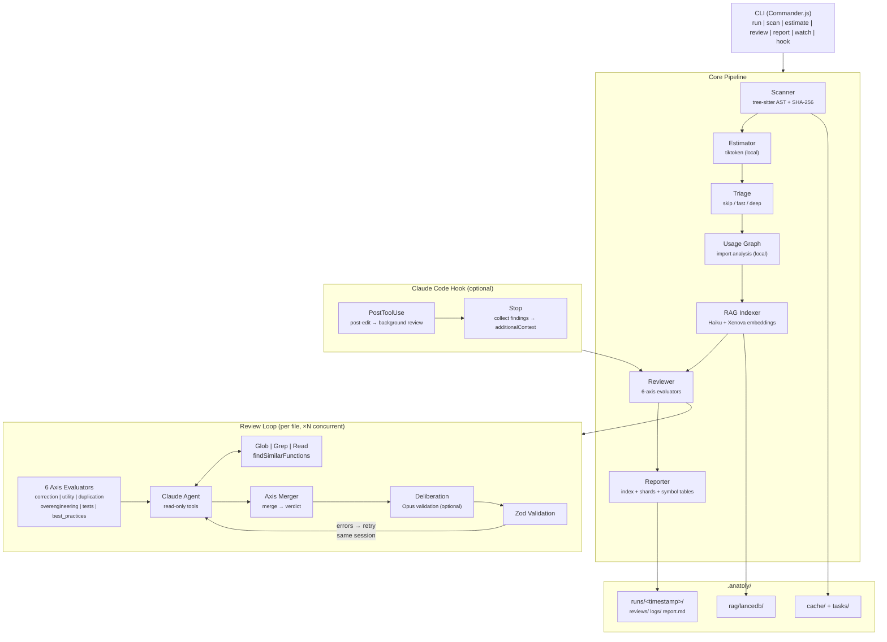

<p align="center">
  
</p>

# Anatoly & his Pals

*"Can I clean here?"*

**The AI janitor crew that deep-audits your TypeScript codebase -- and proves every finding.**

[](https://nodejs.org/) [](https://www.typescriptlang.org/) [](https://opensource.org/licenses/Apache-2.0) [](https://docs.anthropic.com)

```bash
npx anatoly run   # one command, full codebase audit
```

---

> **Fair warning:** This project is context-and-time-hungry by design. Dream-quality code doesn't come cheap -- it takes serious effort (and tokens) to get there.

---

## Meet the Crew

Anatoly is the boss. He orchestrates the crew, dispatches each Pal on every file, and compiles their findings into a single evidence-backed audit report. The Pals do the dirty work. Anatoly makes sure it's proven.

| Pal | Axis | Job description |
|-----|------|-----------------|
| **The Perfectionist** | `correction` | Finds bugs, bad patterns, and code that just ain't right |
| **The Minimalist** | `overengineering` | Calls out abstractions nobody asked for |
| **The Bouncer** | `utility` | Kicks out dead code -- no invite, no entry |
| **The Clone Hunter** | `duplication` | Tracks down copy-paste across file boundaries |
| **The Guardian** | `tests` | Guards the gate -- no coverage, no mercy |
| **The Coach** | `best_practices` | Scores every file against 17 TypeScript best-practice rules |

---

## What is Anatoly?

Anatoly runs a crew of six specialized Pals -- each one an analysis axis powered by a Claude agent with full read access to your codebase and a semantic vector index. Together they walk through every file, investigate it with full project context, and deliver a surgical audit report -- the kind of deep review that would take a senior developer days, done in minutes.

This is not a linter. This is not a static analysis rule set. Anatoly is a **Claude agent with read access to your entire codebase and a semantic vector index**. For every file it reviews, six specialized axes evaluate every symbol independently -- then an optional Opus deliberation pass validates the merged results. The agent can grep for usages across the project, read other files to verify dead code, query a local RAG index to surface semantically similar functions across file boundaries, and cross-reference exports, imports, and test coverage, then it must **prove** each finding with evidence before reporting it.

The result: dead code found with zero false positives. Hidden duplication surfaced across file boundaries. Over-engineered abstractions called out with concrete proof. Missing test coverage quantified per symbol.

**One command. Full codebase. Evidence-backed findings. No code modified.**

## The Problem

TypeScript codebases accumulate technical debt fast, especially when AI-assisted coding tools generate large volumes of code. Dead code, hidden duplication, over-engineered abstractions, and missing test coverage silently degrade maintainability.

Traditional linters catch syntax issues but miss architectural rot. Manual code review doesn't scale. And no existing tool can answer *"is this function actually used anywhere?"* with certainty, because that requires understanding the whole project, not just one file.

## How Anatoly Solves It

Anatoly combines **tree-sitter AST parsing** with an **agentic AI review loop** powered by Claude Agent SDK. The pipeline works in eight phases:

1. **Scan**, Parses every file with tree-sitter to extract symbols (functions, classes, types, hooks, constants) with line ranges and export status
2. **Estimate**, Counts tokens locally with tiktoken so you know the cost before any API call
3. **Triage**, Classifies files into `skip` (barrels, type-only, constants), `fast` (simple files), or `deep` (complex files), eliminating unnecessary API calls
4. **Usage Graph**, Pre-computes an import graph across all files in a single local pass (< 1s), so the agent no longer needs to grep for usage verification
5. **Index**, Builds a semantic RAG index (local embeddings + LanceDB) to detect cross-file duplication invisible to grep
6. **Review**, Launches a Claude agent per file with read-only tools (Glob, Grep, Read, findSimilarFunctions). Simple files get a fast single-turn review; complex files get the full agentic investigation. The agent must **prove** every finding before reporting it
7. **Deliberate**, An optional Opus deliberation pass validates merged findings across axes, filters residual false positives, and ensures inter-axis coherence before the final report
8. **Report**, Aggregates all Zod-validated reviews into a sharded audit report: compact index + per-shard detail files (max 10 files each), sorted by severity, with symbol-level detail tables

### Self-correction loop

The review phase includes an **agent ↔ schema feedback loop**. When the agent produces its JSON output, Anatoly validates it against a strict Zod schema. If validation fails, the exact Zod errors are sent back to the agent **within the same session**, preserving the full investigation context. The agent corrects its output and resubmits, up to `max_retries` times (default: 3).

### Two-pass correction with dependency verification

The Perfectionist (correction axis) runs a **two-pass pipeline** to eliminate false positives caused by library-specific patterns:

1. **Pass 1** -- Standard correction analysis flags `NEEDS_FIX` and `ERROR` symbols
2. **Pass 2** -- A verification agent re-evaluates each finding against the **actual README documentation** of the dependencies involved (read from `node_modules/`). If the library handles the flagged pattern natively, the finding is downgraded to `OK`

False positives are recorded in a **persistent correction memory** (`.anatoly/correction-memory.json`). On subsequent runs, known false positives are injected into the prompt so the agent avoids flagging them again. The memory deduplicates by pattern and dependency.

Additionally, a **contradiction detector** cross-references correction findings against best-practices results -- for example, if best-practices confirms async/error handling is correct (Rule 12 PASS) but correction flags `NEEDS_FIX` on an async pattern, the confidence is automatically lowered below the reporting threshold.

### Crash-resilient axis pipeline

Each of the 6 axes runs independently per file. If one axis crashes, the others continue. The merger injects **crash sentinels** for failed axes (visible in `.rev.md` as "axis crashed -- see transcript") and computes the final verdict from the surviving axes only.

### Opus deliberation pass

After all axes merge their results, an optional **deliberation pass** powered by Claude Opus validates the combined findings. The deliberation agent acts as a senior auditor:

1. **Coherence check** -- Verifies inter-axis findings make sense together (e.g., a function can't be both `DEAD` and `DUPLICATE`)
2. **False-positive filter** -- Re-evaluates `NEEDS_FIX` and `ERROR` findings; downgrades incorrect ones to `OK` (ERROR requires >= 95 confidence to downgrade)
3. **Confidence adjustment** -- Adjusts symbol confidences based on cross-axis evidence
4. **Action cleanup** -- Removes actions tied to invalidated findings

Enable with `llm.deliberation: true` in `.anatoly.yml`. Uses `claude-opus-4-6` by default (configurable via `llm.deliberation_model`). Skips files with high-confidence `CLEAN` verdicts to minimize cost.

### Project tree context

Axes that benefit from structural awareness (`best_practices`, `overengineering`) receive a compact ASCII tree of the project. The tree is automatically condensed to stay under 300 tokens, even on 500+ file projects, giving axes contextual understanding of project scope and organization.

### Claude Code autocorrection hook

Anatoly can plug directly into Claude Code as a **PostToolUse + Stop hook**, creating a real-time audit loop while Claude Code writes your code:

1. **Every time Claude Code edits a file**, the `PostToolUse` hook fires, Anatoly spawns a background review for that file (debounced, SHA-checked, non-blocking)
2. **When Claude Code finishes its task**, the `Stop` hook fires, Anatoly waits for pending reviews, collects all findings above `min_confidence`, and **blocks the stop with the findings as the reason**, forcing Claude Code to address them
3. **Claude Code sees the audit findings** and self-corrects, fixing dead code, removing duplication, simplifying over-engineered abstractions, before the user ever sees the result

The result is an **autonomous write → audit → fix loop**: Claude Code writes, Anatoly audits in real-time, Claude Code fixes. Anti-loop protection via Claude Code's native `stop_hook_active` flag prevents runaway iterations.

```bash
npx anatoly hook init   # generates .claude/settings.json hooks
```

Every finding is backed by evidence. Every review is schema-validated. The agent never guesses,it investigates.

## Key Features

- **AST-driven scanning**,Uses web-tree-sitter (WASM) to extract every function, class, type, enum, constant, and hook with line ranges and export status
- **Evidence-based review**,The Claude agent must grep/read to prove DEAD, DUPLICATE, or OVER findings,no guessing
- **6-axis analysis**,Every symbol evaluated on: correction, overengineering, utility, duplication, test coverage, and best practices
- **Smart triage**,Auto-classifies files into skip/fast/deep tiers; barrels, type-only, and constants skip the LLM entirely; simple files get a fast single-turn review
- **Pre-computed usage graph**,Builds a full import graph in < 1s so the agent doesn't need to grep for usage verification,eliminating ~90 redundant tool calls per review
- **Fast reviewer**,Single-turn `query()` for simple files (3-8s vs 45s), with automatic promotion to deep review on validation failure
- **Sharded reports**,Compact index (~100 lines) + per-shard detail files (max 10 files each), sorted by severity with Markdown checkboxes for agent-driven correction
- **Zod-validated output**,Machine-readable `.rev.json` + human-readable `.rev.md` per file, all schema-validated
- **Smart caching**,SHA-256 per file; unchanged files skip review at zero API cost
- **Token estimation**,Local tiktoken estimation before any API call (no surprise bills)
- **RAG semantic duplication**,Local embeddings (Xenova/all-MiniLM-L6-v2) + LanceDB vector store detect cross-file semantic duplications invisible to grep
- **Run-scoped outputs**,Each run is stored in `.anatoly/runs/<timestamp>/` with a `latest` symlink; old runs auto-purged via `output.max_runs`
- **Watch mode**,Daemon with initial scan, incremental re-review, automatic report regeneration, file deletion handling, and lock management
- **Parallel reviews**,`--concurrency N` runs up to 10 reviews simultaneously with rate limiting and multi-file renderer
- **CI-friendly**,Exit codes: `0` (clean), `1` (findings), `2` (error); `--yes` flag for non-interactive destructive commands
- **Two-pass correction**,Verification pass re-checks findings against library READMEs from `node_modules/`, eliminating dependency-related false positives
- **Correction memory**,Persistent `.anatoly/correction-memory.json` stores known false positives to avoid re-flagging across runs
- **Contradiction detection**,Cross-references correction findings against best-practices results to suppress conflicting verdicts
- **Crash-resilient axes**,Each axis runs independently; if one crashes the others continue with sentinel markers in the report
- **Opus deliberation**,Optional post-merge validation pass (Claude Opus) filters residual false positives and ensures inter-axis coherence
- **Project tree context**,Compact ASCII tree injected into axes that benefit from structural awareness (best practices, overengineering)
- **Symbol-level reports**,Sharded reports include per-symbol detail tables showing each axis rating, confidence, and line ranges
- **Real-time transcript streaming**,LLM reasoning streamed to disk as it happens; `tail -f` to follow evaluations live
- **Verbose token tracking**,`--verbose` shows `[anatoly]`-prefixed logs with per-file token usage, cost, cache hit rates, and timing
- **Markdown axis prompts**,System prompts for all 6 axes stored as editable Markdown files for transparency and customization
- **Coverage integration**,Parses Istanbul/Vitest/Jest coverage data to enrich reviews
- **Crash-resilient state**,Atomic state writes, lock files, and interrupted-run recovery
- **Actionable errors**,Every error includes a recovery hint (`error: <message>\n  → <next step>`)
- **Accessibility**,Respects `$NO_COLOR` env var; `--plain` mode for pipes/CI; `--open` to launch report in default app

## Target Audience

Senior developers, Tech Leads, and teams working in TypeScript/React/Node.js,especially those producing large amounts of AI-generated code with tools like Claude Code, Cursor, or Windsurf. Designed for projects from 20 to 1,000+ TypeScript files.

---

## Architecture



## Tech Stack

| Component | Technology |
|-----------|-----------|
| Runtime | Node.js 20+ |
| Language | TypeScript (ESM, strict mode) |
| CLI | Commander.js |
| Build | tsup (esbuild) |
| Tests | Vitest |
| Lint | ESLint (flat config) |
| AST | web-tree-sitter (WASM) |
| Schema | Zod v4 |
| AI Agent | @anthropic-ai/claude-agent-sdk |
| Tokens | tiktoken (local) |
| Watcher | chokidar v5 |
| Terminal | listr2 + chalk |
| Embeddings | Xenova/all-MiniLM-L6-v2 (384 dim, local) |
| Vector Store | LanceDB (embedded, zero-server) |

## Project Structure

```
src/
├── index.ts              # Entry point
├── cli.ts                # Command registration + global flags
├── commands/             # One file per CLI command (thin wrappers)
│   ├── index.ts          # Command registration barrel
│   ├── run.ts            # Orchestrates: scan → estimate → [index] → review → report
│   ├── watch.ts          # File watcher daemon
│   ├── scan.ts           # Parse AST + compute hashes
│   ├── estimate.ts       # Token estimation
│   ├── review.ts         # Run Claude agent reviews
│   ├── report.ts         # Aggregate → report.md
│   ├── status.ts         # Show progress
│   ├── rag-status.ts     # Inspect RAG index + function cards
│   ├── clean-runs.ts     # Delete old runs (--keep, --yes)
│   ├── reset.ts          # Wipe all state
│   └── hook.ts           # Claude Code hook subcommands (init, post-edit, stop)
├── core/                 # Business logic
│   ├── scanner.ts        # AST + SHA-256 + coverage
│   ├── estimator.ts      # tiktoken token counting
│   ├── triage.ts         # File triage: skip / fast / deep classification
│   ├── usage-graph.ts    # Pre-computed import usage graph
│   ├── axes/             # Per-axis evaluators
│   │   ├── correction.ts, utility.ts, duplication.ts, ...
│   │   └── prompts/      # Editable Markdown system prompts (1 per axis)
│   ├── axis-evaluator.ts # Shared axis evaluation harness
│   ├── axis-merger.ts    # Merges 6 axis results into a single review
│   ├── file-evaluator.ts # Orchestrates axes + merge per file
│   ├── deliberation.ts   # Opus deliberation pass (post-merge validation)
│   ├── project-tree.ts   # Compact ASCII project tree for axis context
│   ├── review-writer.ts  # Writes .rev.json + .rev.md
│   ├── reporter.ts       # Sharded report: index + per-shard files + symbol tables
│   ├── correction-memory.ts # Persistent false-positive memory
│   ├── dependency-meta.ts # Dependency metadata + local README reader
│   ├── progress-manager.ts # Atomic state management
│   └── worker-pool.ts    # Concurrent review pool + semaphore
├── schemas/              # Zod schemas (source of truth)
│   ├── review.ts         # 6-axis review schema
│   ├── task.ts           # AST task schema
│   ├── config.ts         # Config file schema
│   └── progress.ts       # Progress state schema
├── rag/                  # Semantic RAG module
│   ├── types.ts          # FunctionCard schema + types
│   ├── embeddings.ts     # Xenova/all-MiniLM-L6-v2 (local)
│   ├── vector-store.ts   # LanceDB wrapper
│   ├── indexer.ts        # Incremental indexing + AST extraction
│   ├── card-generator.ts # FunctionCard generation via Haiku
│   ├── orchestrator.ts   # Index pipeline orchestration
│   └── index.ts          # Barrel export
└── utils/                # Cross-cutting utilities
    ├── cache.ts           # SHA-256 + atomic writes
    ├── config-loader.ts   # YAML → typed Config
    ├── confirm.ts         # Interactive y/n confirmation prompts
    ├── errors.ts          # AnatolyError + error codes + recovery hints
    ├── extract-json.ts    # JSON extraction from agent responses
    ├── format.ts          # Output formatting helpers
    ├── git.ts             # .gitignore filtering
    ├── hook-state.ts      # Hook state tracking (PIDs, debounce, SHA)
    ├── lock.ts            # PID-based lock file
    ├── open.ts            # Open file with system default app
    ├── process.ts         # Process utilities (signal handling)
    ├── prompt-builder.ts  # Agent prompt construction
    ├── rate-limiter.ts    # Exponential backoff for API rate limits
    ├── run-id.ts          # Run ID generation + symlink + purge
    └── version.ts         # Package version detection
```

Runtime output directory:

```
.anatoly/
├── cache/progress.json                    # Pipeline state
├── tasks/*.task.json                      # AST + hash per file
├── correction-memory.json                 # Known false positives (persistent)
├── rag/                                   # RAG semantic index
│   ├── lancedb/                           # LanceDB vector store
│   └── cache.json                         # File hash → lastIndexed
└── runs/                                  # Run-scoped outputs
    ├── latest → <runId>                   # Symlink to latest run
    └── <YYYY-MM-DD_HHmmss>/
        ├── reviews/*.rev.json             # Machine-readable reviews
        ├── reviews/*.rev.md               # Human-readable reviews
        ├── logs/*.transcript.md           # Full agent reasoning logs
        ├── logs/*.fast.transcript.md      # Fast reviewer transcripts
        ├── report.md                      # Index: summary + shard links
        └── report.N.md                    # Shard N: 10 files with findings
```

---

## Prerequisites

- Node.js >= 20.19
- [Claude Code](https://docs.anthropic.com/en/docs/claude-code) installed and authenticated

## Getting Started

```bash
# Run without installing
npx anatoly run

# Or install globally
npm install -g anatoly
anatoly run
```

The `run` command executes the full pipeline: **scan** → **estimate** → **index** → **review** → **report**. RAG indexing is enabled by default; use `--no-rag` to skip it.

## Usage

### Commands

```bash
npx anatoly run              # Full pipeline: scan → estimate → index → review → report
npx anatoly run --run-id X   # Custom run ID (default: YYYY-MM-DD_HHmmss)
npx anatoly watch            # Daemon mode: initial scan + incremental re-review on change/delete
npx anatoly scan             # Parse AST + compute SHA-256 hashes
npx anatoly estimate         # Estimate token cost (local, no API calls)
npx anatoly review           # Run Claude agent on pending files
npx anatoly report           # Aggregate reviews → report.md
npx anatoly report --run X   # Generate report from a specific run
npx anatoly status           # Show current audit progress
npx anatoly rag-status       # Show RAG index stats (cards, files)
npx anatoly rag-status <fn>  # Inspect a specific function card
npx anatoly clean-runs       # Delete old runs (--keep <n>, --yes)
npx anatoly reset            # Wipe all state (shows summary, asks confirmation)
npx anatoly reset --yes      # Skip confirmation (for CI/scripts)
npx anatoly hook init        # Generate Claude Code hooks configuration
npx anatoly hook post-edit   # PostToolUse hook (called by Claude Code)
npx anatoly hook stop        # Stop hook: collect findings, block if issues
```

### Global Flags

```
--config <path>      Path to .anatoly.yml config file
--verbose            Enable verbose output (per-file time, cost, retries)
--no-cache           Skip cache, re-review all files
--file <glob>        Target specific files (e.g. "src/utils/**/*.ts")
--plain              Disable spinners and colors
--no-color           Disable colors only (also respects $NO_COLOR env var)
--open               Open report in default app after generation
--concurrency <n>    Number of concurrent reviews, 1-10 (default: 4)
--no-rag             Disable semantic RAG cross-file analysis
--rebuild-rag        Force full RAG re-indexation
--no-triage          Disable triage, review all files with full agent
```

### RAG Status Options

```bash
npx anatoly rag-status             # Show index stats (cards, files, last indexed)
npx anatoly rag-status myFunction  # Inspect a function card by name
npx anatoly rag-status --all       # List all indexed function cards
npx anatoly rag-status --json      # Output as JSON (for scripting)
```

### Example Output

Each reviewed file produces two outputs:

**`.rev.json`**,Machine-readable, Zod-validated:

| Axis | Values |
|------|--------|
| `correction` | `OK` / `NEEDS_FIX` / `ERROR` |
| `overengineering` | `LEAN` / `OVER` / `ACCEPTABLE` |
| `utility` | `USED` / `DEAD` / `LOW_VALUE` |
| `duplication` | `UNIQUE` / `DUPLICATE` |
| `tests` | `GOOD` / `WEAK` / `NONE` |
| `best_practices` | Score 0–10 (17 rules) + suggestions |
| `confidence` | 0–100 |

**`report.md`**,Sharded audit report:
- `report.md` — compact index (~100 lines) with executive summary, severity table, checkbox links to shards, and triage stats
- `report.N.md` — per-shard detail files (max 10 files each), sorted by severity with Quick Wins / Refactors / Hygiene actions

## Configuration

Create a `.anatoly.yml` at the project root (optional,sensible defaults apply):

```yaml
project:
  name: "my-ts-project"
  monorepo: true

scan:
  include:
    - "src/**/*.ts"
    - "src/**/*.tsx"
  exclude:
    - "node_modules/**"
    - "dist/**"
    - "**/*.test.ts"
    - "**/*.spec.ts"

coverage:
  enabled: true
  command: "npx vitest run --coverage.reporter=json"
  report_path: "coverage/coverage-final.json"

llm:
  model: "claude-sonnet-4-6"
  fast_model: "claude-haiku-4-5-20251001"  # optional: cheaper model for fast-tier reviews
  agentic_tools: true
  timeout_per_file: 600
  max_retries: 3
  concurrency: 4            # parallel reviews (1-10, or use --concurrency flag)
  min_confidence: 70         # minimum confidence to report findings (hook mode)
  max_stop_iterations: 3     # anti-loop limit for stop hook
  deliberation: true         # enable Opus deliberation pass (default: false)
  deliberation_model: "claude-opus-4-6"  # model for deliberation (default: claude-opus-4-6)

rag:
  enabled: true     # disable with --no-rag or set to false

output:
  max_runs: 10      # optional: purge old runs beyond this limit
```

---

## Development Setup

```bash
git clone https://github.com/r-via/anatoly.git
cd anatoly
npm install
```

### Scripts

```bash
npm run dev        # Run with tsx (direct TS execution)
npm run build      # Build with tsup → dist/index.js
npm test           # Run tests with Vitest
npm run lint       # Lint with ESLint
npm run typecheck  # Type check with tsc --noEmit
```

## Testing

```bash
# Run all tests
npm test

# Run tests in watch mode
npx vitest

# Run a specific test file
npx vitest src/core/scanner.test.ts
```

Tests are co-located with source files (`*.test.ts`) and use Vitest.

---

## Contributing

1. Fork the repository
2. Create a feature branch (`git checkout -b feat/my-feature`)
3. Make your changes and ensure tests pass (`npm test && npm run typecheck`)
4. Commit with a descriptive message
5. Open a Pull Request

Please follow the existing code style and ensure all CI checks pass.

## License

[Apache-2.0](https://opensource.org/licenses/Apache-2.0)

## Contact & Support

- Issues: [github.com/r-via/anatoly/issues](https://github.com/r-via/anatoly/issues)
- Repository: [github.com/r-via/anatoly](https://github.com/r-via/anatoly)
