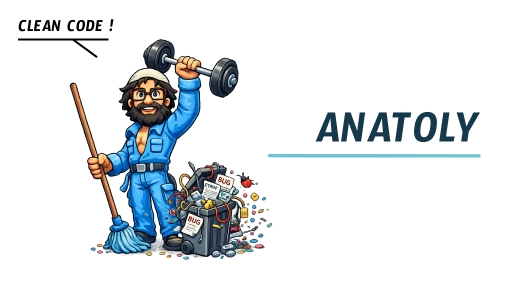

<p align="center">
  
</p>

# Anatoly

*"Can I clean here?"*

**The AI agent that deep-audits your codebase, and proves every finding.**

Named after [a certain cleaning man](https://www.youtube.com/@vladimirfitness) who politely asks *"Can I clean here?"* — then deadlifts the entire rack.

[](https://nodejs.org/) [](https://www.typescriptlang.org/) [](https://www.gnu.org/licenses/agpl-3.0) [](https://docs.anthropic.com)

```bash
npx anatoly run   # one command, full codebase audit
```

---

> **Fair warning:** This project is context-and-time-hungry by design. Dream-quality code doesn't come cheap -- it takes serious effort (and tokens) to get there.

---

## What is Anatoly?

<p align="center">
  
</p>

Anatoly is an **autonomous AI agent augmented by semantic RAG** that walks through every file in your codebase, investigates it with full project context, and delivers a surgical audit report.

Supports **TypeScript, Python, Rust, Go, Java, C#, Bash, SQL, YAML, JSON** — with auto-detection of languages and frameworks (React, Next.js, etc.). AST-driven parsing via tree-sitter for each language.

This is not a linter. This is not a static analysis rule set. Anatoly is a **Claude agent with read access to your entire codebase and a semantic vector index**. The agent can grep for usages across the project, read other files to verify dead code, query a local RAG index to surface semantically similar functions, and cross-reference exports, imports, and test coverage -- then it must **prove** each finding with evidence before reporting it.

**One command. Full codebase. Evidence-backed findings. No code modified.**

## The Problem

TypeScript codebases accumulate technical debt fast, especially when AI-assisted coding tools generate large volumes of code. Dead code, hidden duplication, over-engineered abstractions, and missing test coverage silently degrade maintainability.

Traditional linters catch syntax issues but miss architectural rot. Manual code review doesn't scale. And no existing tool can answer *"is this function actually used anywhere?"* with certainty, because that requires understanding the whole project, not just one file.

## Key Features

- **7-axis analysis** — correction, overengineering, utility, duplication, tests, best practices, documentation — all axes run in parallel per file, each crash-isolated
- **Evidence-based review** — the agent must grep/read to prove every finding before reporting it — no guesswork, no hallucinated issues
- **Opus deliberation** — senior-auditor pass (Opus) reviews merged results, detects inter-axis incoherence, and filters residual false positives. Enabled by default
- **Two-pass correction** — re-evaluates findings against dependency documentation (package.json + node_modules READMEs) to eliminate API-misunderstanding false positives
- **Deliberation memory** — persistent reclassification registry prevents repeated false positives across runs, covers all axes
- **RAG semantic duplication** — local code embeddings + dual code+NLP embedding for hybrid similarity search via LanceDB. Concept-level matching, not just syntax
- **RAG-powered documentation review** — function summaries (Haiku) and doc sections are embedded as NLP vectors. The documentation axis evaluates quality by semantic similarity. Separate from `anatoly docs` which manages internal documentation
- **Internal doc pipeline** — `anatoly docs scaffold` generates `.anatoly/docs/` via Sonnet (parallel scaffold → Opus coherence review → RAG index → gap-driven update). Incremental updates at each run via RAG gap detection (cosine similarity, $0). Doc sections are smart-chunked programmatically (H2+H3+paragraph splitting, no LLM cost) and re-indexed inline after each doc update. `anatoly docs scaffold project` copies internal docs to `docs/` for publishing
- **Auto-Clean via [Ralph Pattern](https://paddo.dev/blog/ralph-wiggum-autonomous-loops/)** — `anatoly clean run` launches an autonomous correction loop that commits each remediation individually and syncs progress back to the report
- **Claude Code hook** — real-time audit loop: write → audit → fix (PostToolUse + Stop hooks with anti-loop protection)
- **Smart triage** — auto-classifies files into skip/evaluate tiers (barrel exports, type-only, trivial files skip at zero API cost)
- **Pre-computed usage graph** — one-pass import resolution across all files with transitive intra-file references, eliminating ~90% of redundant tool calls
- **Local code embeddings** — Jina v2 (768d) on CPU or nomic-embed-code (3584d) + Qwen3-Embedding-8B (4096d) on GPU — zero API cost for RAG indexing
- **Multi-language support** — TypeScript, Python, Rust, Go, Java, C#, Bash, SQL, YAML, JSON with auto-detection. Language-specific best-practices prompts, framework-aware evaluation (React, Next.js)
- **AST-driven scanning** — web-tree-sitter extracts every symbol (functions, classes, types, enums, hooks, constants) with line ranges and export status for each supported language
- **Sharded reports** — compact index + per-shard detail files with symbol-level tables, severity-sorted actions, and checkboxes for Ralph consumption
- **Smart caching** — SHA-256 per file; unchanged files skip review at zero API cost. Second run on unchanged codebase costs $0
- **Dry-run mode** — `--dry-run` simulates the full pipeline (scan, estimate, triage, cost) without API calls. Uses calibrated per-axis timing from past runs
- **Watch mode** — daemon that monitors file changes and triggers incremental re-review + report regeneration
- **CI-friendly** — exit codes `0`/`1`/`2`, `--plain` mode for non-interactive pipelines, colored cost display

> See [Pipeline Overview](docs/02-Architecture/01-Pipeline-Overview.md) for the full pipeline details, and [Seven-Axis System](docs/02-Architecture/02-Seven-Axis-System.md) for the evaluation axes.

### Seven-Axis System

Every file is evaluated through seven independent axes, running in parallel. Each axis focuses on a single dimension of code quality:

| Axis | Default Model | Verdicts | What it detects |
|------|---------------|----------|-----------------|
| **Utility** | Haiku | `USED` `DEAD` `LOW_VALUE` | Dead or unused exports, low-value code |
| **Duplication** | Haiku | `UNIQUE` `DUPLICATE` | Semantically similar functions across the codebase |
| **Correction** | Sonnet | `OK` `NEEDS_FIX` `ERROR` | Bugs, logic errors, async issues (two-pass with dependency verification) |
| **Overengineering** | Haiku | `LEAN` `OVER` `ACCEPTABLE` | Excessive complexity relative to purpose |
| **Tests** | Sonnet | `GOOD` `WEAK` `NONE` | Test coverage quality per symbol |
| **Best Practices** | Sonnet | Score 0-10, 17 rules | Language-specific best-practice violations (context-aware) |
| **Documentation** | Sonnet | `DOCUMENTED` `PARTIAL` `UNDOCUMENTED` | JSDoc gaps on exports, /docs/ desynchronization |

Run specific axes with `--axes`:

```bash
npx anatoly run --axes utility              # single axis
npx anatoly run --axes correction,tests     # multiple axes
npx anatoly run                             # all seven (default)
```

> Each axis is crash-isolated — if one fails, the other six still produce results. See [Seven-Axis System](docs/02-Architecture/02-Seven-Axis-System.md) for scoring model, merger logic, and model configuration.

## Target Audience

Senior developers, Tech Leads, and teams working in TypeScript, Python, Rust, Go, Java, C#, and more -- especially those producing large amounts of AI-generated code with tools like Claude Code, Cursor, or Windsurf. Designed for projects from 20 to 1,000+ source files.

---

## Prerequisites

- Node.js >= 20.19
- [Claude Code](https://docs.anthropic.com/en/docs/claude-code) installed and authenticated

### Optional but recommended: GPU-accelerated embeddings

By default, Anatoly uses ONNX-based code embeddings (Jina v2, 768d) running on CPU. For significantly better duplication detection, set up **Advanced-GGUF mode** which runs Docker llama.cpp server-cuda containers with GGUF Q5_K_M quantized models on GPU:

- **Code:** nomic-embed-code (3584d)
- **NLP:** Qwen3-Embedding-8B (4096d)
- **Sequential mode:** one model loaded at a time (~10 GB VRAM), swaps automatically

**Requirements:** Docker, an NVIDIA GPU with >= 12 GB VRAM

```bash
# One-time setup: pulls Docker images, downloads GGUF models (SHA256-verified)
npx anatoly setup-embeddings

# Check status anytime
npx anatoly setup-embeddings --check
```

Containers start automatically with `anatoly run` when setup is detected. No Python dependency -- Docker is the only runtime requirement for GPU mode.

## Getting Started

```bash
# Run without installing
npx anatoly run

# Or install globally
npm install -g anatoly
anatoly run
```

The `run` command executes the full pipeline: **scan** → **estimate** → **triage** → **usage graph** → **RAG index** → **review** → **doc update** → **report**. RAG indexing is enabled by default; use `--no-rag` to skip it. Internal docs are auto-scaffolded on first run if `.anatoly/docs/` doesn't exist.

## Usage

```bash
# Core pipeline
npx anatoly run                  # Full pipeline: scan → estimate → index → review → doc update → report
npx anatoly run --run-id X       # Custom run ID (default: YYYY-MM-DD_HHmmss)
npx anatoly watch                # Daemon mode: initial scan + incremental re-review on change/delete

# Individual phases
npx anatoly scan                 # Parse AST + compute SHA-256 hashes
npx anatoly estimate             # Estimate token cost (local, no API calls)
npx anatoly review               # Run Claude agent on pending files
npx anatoly report               # Aggregate reviews → report.md

# Documentation management
npx anatoly docs scaffold              # Generate .anatoly/docs/ (full pipeline: scaffold → coherence → RAG → update)
npx anatoly docs scaffold project      # Copy .anatoly/docs/ → docs/ (scaffolds internal first if needed)
npx anatoly docs index                 # Incremental RAG indexing: code + NLP summaries + doc chunks
npx anatoly docs index --rebuild       # Force full re-index
npx anatoly docs gap-detection internal  # Analyze coverage gaps in .anatoly/docs/ vs code (no LLM, $0)
npx anatoly docs gap-detection project   # Analyze coverage gaps in docs/ vs code
npx anatoly docs lint                  # Deterministic structure lint on .anatoly/docs/
npx anatoly docs coherence             # Lint + Opus coherence review on .anatoly/docs/
npx anatoly docs status                # Show internal docs coverage

# Auto-clean (Ralph pattern)
npx anatoly clean generate documentation  # Generate Ralph artifacts from axis findings
npx anatoly clean run documentation       # Generate + run Ralph loop to auto-clean findings
npx anatoly clean sync documentation      # Sync completed clean tasks back to the report

# Maintenance
npx anatoly status               # Show current audit progress
npx anatoly rag-status           # Show RAG index stats
npx anatoly clean runs           # Delete old runs (--keep <n>, --yes)
npx anatoly reset                # Wipe all state (runs, cache, RAG, internal docs)
npx anatoly reset --keep-docs    # Wipe state but keep internal docs
npx anatoly hook init            # Generate Claude Code hooks configuration
npx anatoly init                 # Generate .anatoly.yml with all defaults (commented out)
npx anatoly setup-embeddings     # Install GPU-accelerated embeddings (Docker GGUF)

# Useful flags
npx anatoly run --dry-run        # Simulate: scan, estimate, triage — no API calls
npx anatoly run --no-deliberation # Skip the Opus deliberation pass
npx anatoly run --no-rag         # Skip RAG indexing
npx anatoly run --plain          # Linear output for CI/scripts
```

> See [Configuration](docs/01-Getting-Started/02-Configuration.md) for the full `.anatoly.yml` reference and all CLI flags.

### Dual Embedding (Code + NLP)

Anatoly always uses **dual embedding** — two specialized models working together:

- **Code embedding** — function bodies embedded directly for structural similarity (catches syntactic duplicates)
- **NLP embedding** — Haiku generates a natural language summary, key concepts, and behavioral profile for each function, then embedded with a dedicated NLP model (catches semantic duplicates)

During search, both scores are combined via hybrid similarity:

```
hybrid_score = code_weight × code_similarity + (1 - code_weight) × nlp_similarity
```

This catches functions that **do the same thing** but are implemented differently (different libraries, different paradigms, different naming).

The NLP embeddings also power **doc gap detection** — comparing function summaries against documentation chunks to find undocumented code.

#### Embedding models

At startup, Anatoly detects available hardware and selects the best models:

| Mode | Code Model | NLP Model | Requirements |
|------|-----------|-----------|-------------|
| **Advanced (GGUF)** | nomic-embed-code (3584d) | Qwen3-Embedding-8B (4096d) | Docker + NVIDIA GPU ≥ 12 GB VRAM |
| **Lite (ONNX)** | Jina v2 (768d) | all-MiniLM-L6-v2 (384d) | CPU only |

```yaml
# .anatoly.yml
rag:
  enabled: true
  code_model: auto   # 'auto' = hardware-based selection
  nlp_model: auto    # 'auto' = best available
  code_weight: 0.6   # 60% code similarity, 40% NLP similarity
```

---

## Documentation

| Section | Highlights |
|---------|------------|
| [Getting Started](docs/01-Getting-Started/) | [Vision](docs/01-Getting-Started/00-Vision.md), [Installation](docs/01-Getting-Started/01-Installation.md), [Configuration](docs/01-Getting-Started/02-Configuration.md) |
| [Architecture](docs/02-Architecture/) | [Pipeline](docs/02-Architecture/01-Pipeline-Overview.md), [7-Axis System](docs/02-Architecture/02-Seven-Axis-System.md), [RAG Engine](docs/02-Architecture/03-RAG-Engine.md), [Usage Graph](docs/02-Architecture/04-Usage-Graph.md), [Deliberation](docs/02-Architecture/05-Deliberation-Pass.md) |
| [CLI Reference](docs/03-CLI-Reference/) | [Commands](docs/03-CLI-Reference/01-Commands.md), [Global Options](docs/03-CLI-Reference/02-Global-Options.md), [Output Formats](docs/03-CLI-Reference/03-Output-Formats.md) |
| [Core Modules](docs/04-Core-Modules/) | [Scanner](docs/04-Core-Modules/01-Scanner.md), [Estimator](docs/04-Core-Modules/02-Estimator.md), [Triage](docs/04-Core-Modules/03-Triage.md), [Evaluators](docs/04-Core-Modules/04-Axis-Evaluators.md), [Reporter](docs/04-Core-Modules/05-Reporter.md), [Worker Pool](docs/04-Core-Modules/06-Worker-Pool.md) |
| [Integration](docs/05-Integration/) | [Claude Code Hooks](docs/05-Integration/01-Claude-Code-Hooks.md), [CI/CD](docs/05-Integration/02-CI-CD.md), [Watch Mode](docs/05-Integration/03-Watch-Mode.md) |
| [Development](docs/06-Development/) | [Source Tree](docs/06-Development/00-Source-Tree.md), [Contributing](docs/06-Development/01-Contributing.md), [Testing](docs/06-Development/02-Testing.md), [Schemas](docs/06-Development/03-Schemas.md) |
| [Design Decisions](docs/07-Design-Decisions/) | [Why Local RAG](docs/07-Design-Decisions/01-Why-Local-RAG.md), [Evidence-Based](docs/07-Design-Decisions/02-Evidence-Based-Approach.md), [Cost Optimization](docs/07-Design-Decisions/03-Cost-Optimization.md) |

---

## Development Setup

```bash
git clone https://github.com/r-via/anatoly.git
cd anatoly
npm install
```

### Scripts

```bash
npm run dev        # Run with tsx (direct TS execution)
npm run build      # Build with tsup → dist/index.js
npm test           # Run tests with Vitest
npm run lint       # Lint with ESLint
npm run typecheck  # Type check with tsc --noEmit
```

## Testing

```bash
npm test                              # Run all tests
npx vitest                            # Watch mode
npx vitest src/core/scanner.test.ts   # Specific test file
```

Tests are co-located with source files (`*.test.ts`) and use Vitest.

---

## Contributing

1. Fork the repository
2. Create a feature branch (`git checkout -b feat/my-feature`)
3. Make your changes and ensure tests pass (`npm test && npm run typecheck`)
4. Commit with a descriptive message
5. Open a Pull Request

By contributing, you agree to the [Contributor License Agreement](CLA.md).
This is necessary because Anatoly uses dual licensing (AGPL-3.0 + commercial).

Please follow the existing code style and ensure all CI checks pass.

## License

Anatoly is dual-licensed:

- **Open source** — [AGPL-3.0](https://www.gnu.org/licenses/agpl-3.0):
  free for open source, personal, and academic use.
- **Commercial** — a proprietary license is available for companies that
  cannot comply with AGPL-3.0. See [COMMERCIAL.md](COMMERCIAL.md) for
  details.

## Contact & Support

- Issues: [github.com/r-via/anatoly/issues](https://github.com/r-via/anatoly/issues)
- Repository: [github.com/r-via/anatoly](https://github.com/r-via/anatoly)

<!-- checked-by-anatoly -->
[](https://github.com/r-via/anatoly)
<!-- /checked-by-anatoly -->
