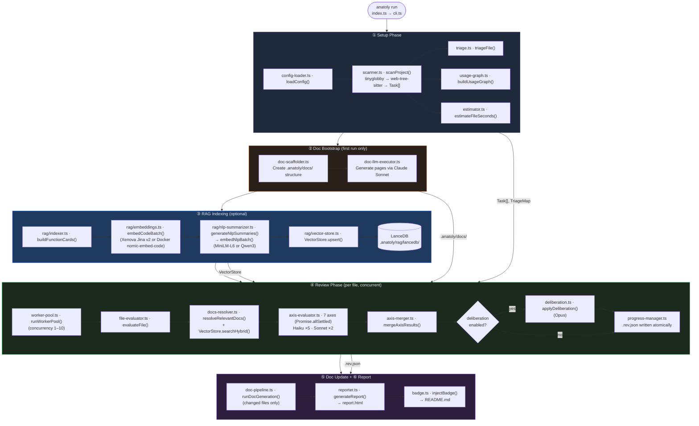

# Data Flow

> End-to-end data flow of the `anatoly run` pipeline — from CLI invocation through file parsing, RAG indexing, parallel axis evaluation, and HTML report generation.

## Overview

`anatoly run` executes a deterministic, multi-phase pipeline orchestrated by `src/commands/run.ts`. Each phase produces typed artifacts written to the `.anatoly/` state directory, making the pipeline resumable and cache-friendly. A shared `RunContext` object threads configuration, concurrency primitives, cost accumulators, and live UI state across every phase.

The six primary phases are:

| # | Phase | Module | Key Output |
|---|-------|--------|------------|
| 1 | Setup | `core/scanner.ts`, `core/triage.ts` | `Task[]`, `TriageMap` |
| 2 | Doc Bootstrap *(first run only)* | `core/doc-pipeline.ts` | `.anatoly/docs/` scaffold |
| 3 | RAG Indexing | `rag/orchestrator.ts` | LanceDB vector table |
| 4 | Review Pass 1 | `core/file-evaluator.ts` | `.rev.json` files |
| 5 | Internal Docs Update | `core/doc-pipeline.ts` | Updated `.anatoly/docs/` |
| 6 | Report | `core/reporter.ts` | `report.html`, badge |

On first run, a second Review Pass executes after phase 5 so evaluators benefit from freshly-generated internal documentation.

---

## Full Pipeline Diagram



---

## Stage 1 — Setup Phase

### Config Loading

`loadConfig()` from `src/utils/config-loader.ts` reads `.anatoly.yml` and validates it via Zod. The resolved `Config` object governs every downstream decision: enabled axes, Claude model selection, concurrency limits, RAG settings, and scan globs.

### File Scanning (`src/core/scanner.ts`)

`scanProject(projectRoot, config)` discovers every file matching `scan.include` / `scan.exclude`, then parses each one:

1. **Language detection** — `src/core/language-detect.ts` identifies TypeScript, JavaScript, Python, Go, Rust, and others from extension and shebang.
2. **AST parsing** — `web-tree-sitter` loads WASM grammars. TypeScript/TSX uses the bundled `tree-sitter-typescript` package. Other languages load dynamically from cache or CDN.
3. **Symbol extraction** — `src/core/language-adapters.ts` traverses the AST to emit `SymbolInfo[]` (name, kind, exported, line range). Falls back to heuristic regex extraction on parse failure.
4. **SHA-256 hashing** — `computeFileHash()` produces the content hash. Files whose hash matches a `DONE` entry in `progress.json` are skipped at zero cost.

Each file yields a `Task` written atomically to `.anatoly/tasks/<file>.task.json`:

```typescript
interface Task {
  version: 1;
  file: string;           // relative path from projectRoot
  hash: string;           // SHA-256 of file content
  symbols: SymbolInfo[];  // { name, kind, exported, line_start, line_end }
  language?: string;      // e.g. 'typescript'
  parse_method?: 'ast' | 'heuristic';
  framework?: string;     // e.g. 'react', 'express'
  scanned_at: string;     // ISO 8601
}
```

### Usage Graph (`src/core/usage-graph.ts`)

`buildUsageGraph(tasks, projectRoot)` performs static import analysis across all tasks. The resulting `UsageGraph` maps every exported symbol to the files that import it — used by the `utility` axis to distinguish live exports from dead code.

### Triage (`src/core/triage.ts`)

`triageFile(task, source)` classifies each file before any LLM call:

| Tier | Criteria |
|------|----------|
| `skip` | Barrel re-exports, type-only files, constants-only modules, < 10 lines |
| `evaluate` | All other files |

Skipped files receive a synthetic `CLEAN` review immediately; no API call is made.

---

## Stage 2 — Doc Bootstrap *(first run only)*

`src/core/doc-scaffolder.ts` creates the `.anatoly/docs/` directory structure on first invocation. `src/core/doc-llm-executor.ts` then generates each page via Claude Sonnet using `query()` from `@anthropic-ai/claude-agent-sdk`. The number of pages that fail to generate determines whether a second Review Pass is scheduled after Stage 5.

---

## Stage 3 — RAG Indexing

`indexProject()` from `src/rag/orchestrator.ts` runs four sequential sub-phases when `rag.enabled: true`:

**Code phase** — `src/rag/indexer.ts · buildFunctionCards()` extracts each function's signature, cyclomatic complexity score (1–5), internal call list, and a body hash for cache invalidation. `src/rag/embeddings.ts · embedCodeBatch()` embeds cards with the code model:
- Lite mode: `jinaai/jina-embeddings-v2-base-code` via `@xenova/transformers` (768 dimensions)
- Advanced mode: `nomic-embed-code` via Docker GGUF container (3584 dimensions)

GPU availability is auto-detected via `src/rag/hardware-detect.ts`.

**NLP phase** *(dual embedding only)* — `src/rag/nlp-summarizer.ts · generateNlpSummaries()` calls Claude Haiku to produce natural-language summaries (cached in `nlp-summary-cache.json`). `embedNlpBatch()` embeds them:
- Lite: `Xenova/all-MiniLM-L6-v2` (384 dimensions)
- Advanced: `Qwen3-Embedding-8B` (4096 dimensions)

**Upsert phase** — `src/rag/vector-store.ts · VectorStore.upsert()` writes rows into a LanceDB table at `.anatoly/rag/lancedb/`. IDs are 16-char hex strings from `buildFunctionId()`; paths are sanitised before SQL-like where clauses.

**Doc phase** — `src/rag/doc-indexer.ts · indexDocSections()` embeds `.anatoly/docs/` markdown sections as `type: 'doc_section'` rows, enabling the `documentation` axis to retrieve relevant pages via vector search. Sections are produced by `smartChunkDoc()` — a programmatic H2+H3+paragraph splitter that replaced the former Haiku LLM chunker at zero API cost.

---

## Stage 4 — Review Phase

`src/core/worker-pool.ts · runWorkerPool()` dispatches files to a concurrent worker pool (1–10 workers). For each non-skipped file, `src/core/file-evaluator.ts · evaluateFile()` runs:

### 1. Context Assembly

```typescript
interface AxisContext {
  task: Task;
  fileContent: string;
  config: Config;
  projectRoot: string;
  usageGraph?: UsageGraph;
  preResolvedRag?: PreResolvedRag;    // RAG hits pre-fetched per symbol
  fileDeps?: FileDependencyContext;
  projectTree?: string;
  testFileContent?: string;
  docsTree?: string | null;
  relevantDocs?: RelevantDoc[];
  conversationDir?: string;
  semaphore?: Semaphore;
}
```

`src/core/docs-resolver.ts · resolveRelevantDocs()` calls `VectorStore.searchHybrid(codeVector, nlpVector, limit, codeWeight)` to retrieve the most semantically relevant documentation sections for the file's symbols.

### 2. Seven-Axis Parallel Evaluation

All axes implement `evaluate(ctx: AxisContext, abort: AbortController): Promise<AxisResult>` and run concurrently via `Promise.allSettled()`:

| Axis | Module | Model | What It Evaluates |
|------|--------|-------|-------------------|
| `utility` | `axes/utility.ts` | Haiku | Dead code, unused exports |
| `duplication` | `axes/duplication.ts` | Haiku | Near-duplicate functions (via RAG) |
| `overengineering` | `axes/overengineering.ts` | Haiku | Excessive abstraction |
| `tests` | `axes/tests.ts` | Haiku | Test coverage quality |
| `documentation` | `axes/documentation.ts` | Haiku | JSDoc coverage, concept-to-docs mapping |
| `correction` | `axes/correction.ts` | Sonnet | Bugs, type errors, logic errors |
| `best_practices` | `axes/best-practices.ts` | Sonnet | Language-specific rules |

Each axis calls `runSingleTurnQuery()` in `src/core/axis-evaluator.ts`, which invokes `query()` from `@anthropic-ai/claude-agent-sdk`, extracts JSON from the response, and validates it against an axis-specific Zod schema. A global `Semaphore` in `src/core/sdk-semaphore.ts` caps total in-flight SDK calls across all workers and axes.

### 3. Result Merging (`src/core/axis-merger.ts`)

`mergeAxisResults(task, axisResults[])` combines seven `AxisResult` objects into a single `ReviewFile`:

- Per-symbol verdicts are merged field-by-field (each axis writes its own column).
- Coherence rules are applied (e.g., `utility: DEAD` → `tests: NONE`).
- Actions are de-duplicated, sorted by severity, and assigned sequential IDs.
- File verdict: `CRITICAL` if any symbol has a high-confidence error; `NEEDS_REFACTOR` if any actionable issue exists; `CLEAN` otherwise.

### 4. Optional Deliberation (`src/core/deliberation.ts`)

When `llm.deliberation: true`, `applyDeliberation()` sends the merged `ReviewFile` to Claude Opus for a coherence review. Findings below 85% confidence may be reclassified. Results are stored in `ReviewFile.deliberation`.

### 5. Output

`src/core/progress-manager.ts` atomically advances the file's status to `DONE` in `progress.json`. The final `ReviewFile` is written to `.anatoly/reviews/<file>.rev.json`.

```typescript
interface ReviewFile {
  version: 1;
  file: string;
  verdict: 'CLEAN' | 'NEEDS_REFACTOR' | 'CRITICAL';
  symbols: SymbolReview[];        // per-symbol verdict per axis
  best_practices?: { score: number; rules: Rule[] };
  actions: Action[];              // { id, description, severity, effort, category }
  axis_meta: Record<string, { calls: number; totalCostUsd: number; inputTokens: number; outputTokens: number }>;
  docs_coverage?: { target_lines: number; covered_lines: number };
  degraded?: boolean;             // true if any axis threw
}
```

---

## Stage 5 & 6 — Doc Update and Report

`src/core/doc-pipeline.ts · runDocGeneration()` regenerates only `.anatoly/docs/` pages whose source files changed (checked via task hash vs. doc-cache entries). After the doc update, `smartChunkAndCache()` pre-populates the chunk cache with programmatic sections, then `indexDocSections()` re-embeds and upserts only the changed files to the vector store (GGUF containers are briefly restarted in advanced mode). This ensures the RAG index stays current without deferring re-indexing to the next run.

<!-- Note: docs may be outdated — verified against source. The report output is report.html, not report.md as referenced in some earlier documentation versions. -->

`src/core/reporter.ts · generateReport()` reads all `.rev.json` files, aggregates findings by severity and axis, and writes `report.html` into the run directory. `src/core/badge.ts · injectBadge()` optionally updates `README.md` with an audit badge reflecting the global `CLEAN / NEEDS_REFACTOR / CRITICAL` verdict.

---

## Concurrency Model

Two independent limits prevent resource exhaustion:

| Setting | Config Key | Default | Controls |
|---------|------------|---------|----------|
| File concurrency | `llm.concurrency` | `4` | Files evaluated in parallel |
| SDK concurrency | `llm.sdk_concurrency` | `8` | Max in-flight Claude API calls (global, across all files × axes) |

Each in-flight call is paired with an `AbortController` stored in `RunContext.activeAborts`. On `SIGINT`, all controllers are triggered and Docker containers are stopped before process exit.

---

## Artifact Layout

```
.anatoly/
├── cache/
│   └── progress.json             # PENDING / IN_PROGRESS / DONE / ERROR per file
├── tasks/
│   └── src/api/router.ts.task.json
├── reviews/
│   └── src/api/router.ts.rev.json
├── rag/
│   ├── lancedb/                  # LanceDB vector tables
│   ├── rag-cache.json            # Code embedding cache (file hash → indexed)
│   └── nlp-summary-cache.json    # NLP summary cache (bodyHash → summary)
├── docs/                         # Generated internal documentation
└── <runId>/
    ├── report.html               # Aggregated audit report
    ├── report-index.json
    ├── run-config.json
    ├── run-metrics.json
    ├── anatoly.ndjson            # Pino structured log
    ├── reviews/                  # Snapshot of .rev.json for this run
    └── conversations/            # Raw LLM I/O transcripts
```

---

## Examples

### Inspecting a `Task` produced by `scanProject`

```typescript
import { scanProject } from './src/core/scanner.js'
import { loadConfig }  from './src/utils/config-loader.js'

const projectRoot = process.cwd()
const config = loadConfig(projectRoot)

const { tasks, skippedCount } = await scanProject(projectRoot, config)

const task = tasks.find(t => t.file === 'src/api/router.ts')!
console.log(task)
// {
//   version: 1,
//   file: 'src/api/router.ts',
//   hash: 'f3a9b12c...',
//   symbols: [
//     { name: 'createRouter', kind: 'function', exported: true, line_start: 12, line_end: 78 },
//     { name: 'RouteHandler', kind: 'type',     exported: true, line_start:  8, line_end:  9 }
//   ],
//   language: 'typescript',
//   parse_method: 'ast',
//   framework: 'express',
//   scanned_at: '2026-03-22T14:32:01.000Z'
// }
```

### Running RAG indexing and querying similar functions

```typescript
import { indexProject }  from './src/rag/orchestrator.js'
import { loadConfig }    from './src/utils/config-loader.js'
import { scanProject }   from './src/core/scanner.js'

const projectRoot = process.cwd()
const config = loadConfig(projectRoot)
const { tasks } = await scanProject(projectRoot, config)

const { vectorStore } = await indexProject({ projectRoot, tasks, config })

// Find functions semantically similar to a query vector
const results = await vectorStore.searchHybrid(codeEmbedding, nlpEmbedding, 10, 0.7)
for (const { card, score } of results) {
  console.log(`${card.name} (${card.filePath}) — score: ${score.toFixed(3)}`)
}
```

### Reading a `ReviewFile` from disk

```typescript
import { readFileSync }   from 'node:fs'
import { ReviewFileSchema } from './src/schemas/review.js'

const raw    = readFileSync('.anatoly/reviews/src/api/router.ts.rev.json', 'utf8')
const review = ReviewFileSchema.parse(JSON.parse(raw))

console.log(review.verdict) // 'CLEAN' | 'NEEDS_REFACTOR' | 'CRITICAL'

for (const sym of review.symbols) {
  if (sym.utility === 'DEAD') {
    console.log(`Dead export: ${sym.name} at line ${sym.line_start}`)
  }
  if (sym.duplication === 'DUPLICATE' && sym.duplicate_target) {
    console.log(`Duplicate of ${sym.duplicate_target.symbol} in ${sym.duplicate_target.file}`)
  }
}

for (const action of review.actions) {
  console.log(`[${action.severity}] ${action.description}`)
}
```

---

## See Also

- [Architecture Overview](./01-Pipeline-Overview.md) — component map and design principles.
- [Seven-Axis System](./02-Seven-Axis-System.md) — per-axis prompt design, verdict semantics, and coherence rules.
- [RAG Engine](./03-RAG-Engine.md) — embedding models, LanceDB schema, and hybrid search internals.
- [Deliberation Pass](./05-Deliberation-Pass.md) — Opus coherence review and confidence reclassification.
- [Configuration Reference](../04-Reference/01-Configuration.md) — all `.anatoly.yml` keys with defaults.
