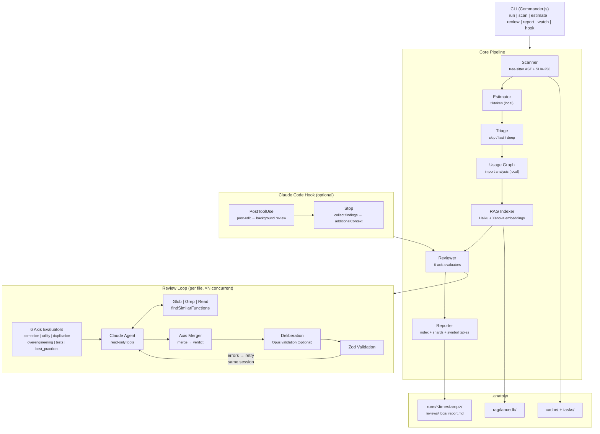

# Architecture



## Tech Stack

| Component | Technology |
|-----------|-----------|
| Runtime | Node.js 20+ |
| Language | TypeScript (ESM, strict mode) |
| CLI | Commander.js |
| Build | tsup (esbuild) |
| Tests | Vitest |
| Lint | ESLint (flat config) |
| AST | web-tree-sitter (WASM) |
| Schema | Zod v4 |
| AI Agent | @anthropic-ai/claude-agent-sdk |
| Tokens | tiktoken (local) |
| Watcher | chokidar v5 |
| Terminal | listr2 + chalk |
| Embeddings | Xenova/all-MiniLM-L6-v2 (384 dim, local) |
| Vector Store | LanceDB (embedded, zero-server) |

## Project Structure

```
src/
├── index.ts              # Entry point
├── cli.ts                # Command registration + global flags
├── commands/             # One file per CLI command (thin wrappers)
│   ├── index.ts          # Command registration barrel
│   ├── run.ts            # Orchestrates: scan → estimate → [index] → review → report
│   ├── watch.ts          # File watcher daemon
│   ├── scan.ts           # Parse AST + compute hashes
│   ├── estimate.ts       # Token estimation
│   ├── review.ts         # Run Claude agent reviews
│   ├── report.ts         # Aggregate → report.md
│   ├── review-display.ts # Review result display formatting
│   ├── status.ts         # Show progress
│   ├── rag-status.ts     # Inspect RAG index + function cards
│   ├── clean-runs.ts     # Delete old runs (--keep, --yes)
│   ├── reset.ts          # Wipe all state
│   └── hook.ts           # Claude Code hook subcommands (init, post-edit, stop)
├── core/                 # Business logic
│   ├── scanner.ts        # AST + SHA-256 + coverage
│   ├── estimator.ts      # tiktoken token counting
│   ├── triage.ts         # File triage: skip / fast / deep classification
│   ├── usage-graph.ts    # Pre-computed import usage graph
│   ├── axes/             # Per-axis evaluators
│   │   ├── correction.ts, utility.ts, duplication.ts, ...
│   │   └── prompts/      # Editable Markdown system prompts (1 per axis)
│   ├── axis-evaluator.ts # Shared axis evaluation harness
│   ├── axis-merger.ts    # Merges 6 axis results into a single review
│   ├── file-evaluator.ts # Orchestrates axes + merge per file
│   ├── deliberation.ts   # Opus deliberation pass (post-merge validation)
│   ├── project-tree.ts   # Compact ASCII project tree for axis context
│   ├── review-writer.ts  # Writes .rev.json + .rev.md
│   ├── reporter.ts       # Sharded report: index + per-shard files + symbol tables
│   ├── correction-memory.ts # Persistent false-positive memory
│   ├── dependency-meta.ts # Dependency metadata + local README reader
│   ├── badge.ts           # README badge injection/update
│   ├── progress-manager.ts # Atomic state management
│   └── worker-pool.ts    # Concurrent review pool + semaphore
├── schemas/              # Zod schemas (source of truth)
│   ├── review.ts         # 6-axis review schema
│   ├── task.ts           # AST task schema
│   ├── config.ts         # Config file schema
│   └── progress.ts       # Progress state schema
├── rag/                  # Semantic RAG module
│   ├── types.ts          # FunctionCard schema + types
│   ├── embeddings.ts     # Code embedding (jinaai/jina-embeddings-v2-base-code)
│   ├── vector-store.ts   # LanceDB wrapper
│   ├── indexer.ts        # Incremental indexing + AST extraction
│   ├── orchestrator.ts   # Index pipeline orchestration
│   └── index.ts          # Barrel export
├── types/
│   └── md.d.ts            # Type declarations for Markdown imports
└── utils/                # Cross-cutting utilities
    ├── cache.ts           # SHA-256 + atomic writes
    ├── config-loader.ts   # YAML → typed Config
    ├── confirm.ts         # Interactive y/n confirmation prompts
    ├── errors.ts          # AnatolyError + error codes + recovery hints
    ├── extract-json.ts    # JSON extraction from agent responses
    ├── format.ts          # Output formatting helpers
    ├── git.ts             # .gitignore filtering
    ├── hook-state.ts      # Hook state tracking (PIDs, debounce, SHA)
    ├── lock.ts            # PID-based lock file
    ├── log-context.ts     # AsyncLocalStorage log context propagation
    ├── logger.ts          # Centralized pino logger (singleton + factory)
    ├── open.ts            # Open file with system default app
    ├── process.ts         # Process utilities (signal handling)
    ├── rate-limiter.ts    # Exponential backoff for API rate limits
    ├── run-id.ts          # Run ID generation + symlink + purge
    └── version.ts         # Package version detection
```

## Runtime Output Directory

```
.anatoly/
├── cache/progress.json                    # Pipeline state
├── tasks/*.task.json                      # AST + hash per file
├── correction-memory.json                 # Known false positives (persistent)
├── rag/                                   # RAG semantic index
│   ├── lancedb/                           # LanceDB vector store
│   └── cache.json                         # File hash → lastIndexed
└── runs/                                  # Run-scoped outputs
    ├── latest → <runId>                   # Symlink to latest run
    └── <YYYY-MM-DD_HHmmss>/
        ├── reviews/*.rev.json             # Machine-readable reviews
        ├── reviews/*.rev.md               # Human-readable reviews
        ├── logs/*.transcript.md           # Full agent reasoning logs
        ├── logs/*.fast.transcript.md      # Fast reviewer transcripts
        ├── report.md                      # Index: summary + shard links
        ├── report.N.md                    # Shard N: 10 files with findings
        ├── anatoly.ndjson                 # Debug-level structured log (auto-created)
        └── run-metrics.json               # Phase durations, cost, findings, errors
```
