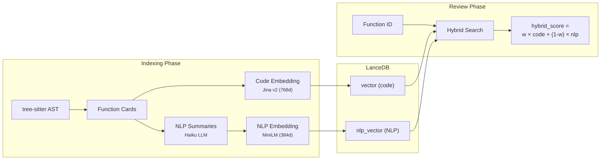

# RAG Pipeline

Anatoly's RAG (Retrieval-Augmented Generation) module detects **cross-file semantic duplication** that grep and AST analysis cannot find. It builds a vector index of all functions in the project and uses similarity search during the review phase to surface near-duplicates.

## Overview



## Embedding Models

Anatoly uses **two separate specialized models** for dual embedding:

| Role | Default Model | Dimensions | Optimized For |
|------|--------------|------------|---------------|
| Code | `jinaai/jina-embeddings-v2-base-code` | 768 | Source code structure, syntax patterns |
| NLP | `Xenova/all-MiniLM-L6-v2` | 384 | Natural language semantic similarity |

Both models run locally via `@xenova/transformers` (ONNX/WASM) — no external API calls for embedding.

### Why two models?

A single general-purpose model is mediocre at both tasks. Specialized models excel in their domain:

- **Code model** captures structural similarity: same control flow, similar API calls, matching patterns
- **NLP model** captures intentional similarity: functions that *do the same thing* regardless of implementation

Example: `fetchUserProfile()` using `axios` and `getUserData()` using `fetch` are structurally different but intentionally identical. The NLP model catches this; the code model doesn't.

### Model selection

Models are configured via `.anatoly.yml` or CLI flags:

```yaml
rag:
  code_model: auto    # or a HuggingFace model ID
  nlp_model: auto     # or a HuggingFace model ID
```

```bash
anatoly run --code-model jinaai/jina-embeddings-v2-base-code --nlp-model Xenova/all-MiniLM-L6-v2
```

When set to `auto` (default), Anatoly detects available hardware at startup and selects the best compatible model.

## Hardware Detection

At startup, Anatoly probes the system for:

| Check | Method | Purpose |
|-------|--------|---------|
| RAM | `os.totalmem()` | Determines if large models fit in memory |
| CPU cores | `os.cpus()` | Parallelization potential |
| NVIDIA GPU | `nvidia-smi` | CUDA availability |
| Apple Silicon | `sysctl machdep.cpu.brand_string` | Metal availability |
| AMD GPU | `rocm-smi` | ROCm availability |

Current model resolution:

| Hardware | Code Model | NLP Model |
|----------|-----------|-----------|
| Any (ONNX runtime) | `jina-v2-base-code` (768d, 161M params) | `all-MiniLM-L6-v2` (384d, ~22M params) |
| GPU + 16GB+ RAM | `nomic-embed-code` eligible (7B, GGUF) — *pending GGUF runtime integration* | `all-MiniLM-L6-v2` |

The architecture is ready for `nomic-ai/nomic-embed-code` (7B) when GGUF runtime support is added. The model registry in `src/rag/hardware-detect.ts` can be extended with new models.

## Indexing Pipeline

### 1. Function card extraction

For each TypeScript file, tree-sitter extracts function/method/hook symbols. Each symbol becomes a **FunctionCard**:

```typescript
interface FunctionCard {
  id: string;              // SHA-256(filePath:lineStart-lineEnd), 16 hex chars
  filePath: string;
  name: string;
  signature: string;       // First line(s) up to opening brace
  summary?: string;        // NLP-generated (dual mode only)
  keyConcepts?: string[];  // Semantic keywords (dual mode only)
  behavioralProfile?: string; // pure | sideEffectful | async | memoized | stateful | utility
  complexityScore: number; // 1-5 cyclomatic complexity
  calledInternals: string[]; // Functions called within the same file
  lastIndexed: string;     // ISO timestamp
}
```

### 2. Code embedding

Each function body is embedded using the code model:

```
// functionName
function signature(args: Type): ReturnType
<function body, truncated to 1500 chars>
```

This produces a 768-dimensional vector (with Jina v2) stored in the `vector` column of LanceDB.

### 3. NLP summarization (dual mode)

When `dual_embedding: true`, the `index_model` (Haiku by default) generates for each function:

- **summary**: What the function does and *why* (max 400 chars)
- **keyConcepts**: 3-7 semantic keywords (e.g., "caching", "authentication", "data-transformation")
- **behavioralProfile**: One of `pure`, `sideEffectful`, `async`, `memoized`, `stateful`, `utility`

Summaries are generated in batches (one LLM call per file for all functions in that file).

### 4. NLP embedding (dual mode)

The NLP summary is formatted and embedded using the NLP model:

```
Function: fetchUserProfile
Purpose: Retrieves user profile data from the API with retry logic and caching
Concepts: API, user-data, caching, retry, error-handling
Behavior: async
```

This produces a 384-dimensional vector (with MiniLM) stored in the `nlp_vector` column.

### 5. Incremental indexing

Anatoly caches the file hash for each indexed function card. On subsequent runs, only functions in changed files are re-indexed. The cache is stored in `.anatoly/rag/cache.json`.

A garbage collector removes cards for files that no longer exist in the project.

## Search

### Code-only search (default)

When dual embedding is disabled, search uses cosine similarity on code vectors:

```
cosine_similarity = 1 - L2² / 2
```

LanceDB uses L2 (euclidean) distance by default. For normalized vectors, this converts directly to cosine similarity.

Default threshold: `minScore = 0.75` (code), `0.65` (NLP).

### Hybrid search (dual mode)

When the index contains NLP vectors, hybrid search combines both signals:

```
hybrid_score = code_weight × code_score + (1 - code_weight) × nlp_score
```

Default `code_weight = 0.6` (60% code, 40% NLP).

The search runs both code and NLP queries in parallel with a lower individual threshold (0.5), merges results by function ID, computes the hybrid score, and filters by the final threshold (0.70).

### Dimension mismatch handling

When the configured model changes (e.g., switching from Jina to a different code model), the stored vector dimensions won't match. Anatoly detects this at startup:

1. Reads a sample row from LanceDB
2. Compares stored dimensions against the configured model's dimensions
3. If mismatched: drops the table, clears the RAG cache, triggers full re-indexation

This check runs independently for code vectors and NLP vectors.

## Module Structure

```
src/rag/
├── hardware-detect.ts   # Hardware detection, model registry, model resolution
├── embeddings.ts        # Dual model loading, embedCode/embedNlp, text builders
├── vector-store.ts      # LanceDB wrapper, search (code/NLP/hybrid), upsert, stats
├── indexer.ts           # Card building, embedding, NLP summary application, cache
├── nlp-summarizer.ts    # LLM-based NLP summary generation (batched per file)
├── orchestrator.ts      # Index pipeline orchestration, worker pool
├── types.ts             # FunctionCard, SimilarityResult, RagStats schemas
└── index.ts             # Barrel exports
```

## Configuration Reference

```yaml
rag:
  enabled: true           # Enable/disable RAG (default: true)
  dual_embedding: false   # Enable dual code+NLP embedding (default: false)
  code_model: auto        # Code embedding model (default: auto)
  nlp_model: auto         # NLP embedding model (default: auto)
  code_weight: 0.6        # Hybrid search weighting (default: 0.6)
```

### CLI flags

```
--no-rag               Disable RAG entirely
--rebuild-rag          Force full re-indexation (drops existing index)
--dual-embedding       Enable dual embedding (overrides config)
--no-dual-embedding    Disable dual embedding (overrides config)
--code-model <model>   Override code embedding model
--nlp-model <model>    Override NLP embedding model
```

### Inspecting the index

```bash
anatoly rag-status              # Summary: cards, files, mode, models
anatoly rag-status --all        # List all indexed functions
anatoly rag-status fetchUser    # Inspect a specific function card
anatoly rag-status --json       # Machine-readable output
```

## Cost Considerations

| Component | Cost | When |
|-----------|------|------|
| Code embedding | Free (local ONNX) | Always |
| NLP embedding | Free (local ONNX) | Dual mode only |
| NLP summarization | ~$0.001/file (Haiku) | Dual mode, first index + changed files |
| Vector search | Free (local LanceDB) | Every review |

Dual embedding adds LLM cost during indexing only. Search is always free. For a 200-file project, expect ~$0.20 for the initial NLP summarization pass (incremental re-indexing costs are minimal).
